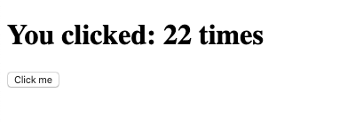

# Technical test: Deploy the Golang counter Web App

**This exercise is completely free if you use the 12 months free tier offer**.

In this test, we want to deploy the provided Application, on an infrastructure powered by AWS EC2 (Instances and Elastic Load Balancer) and ElastiCache (redis).

This application will be composed of multiple stages:
- Staging
- Production

In this exercise, you will have to provide a Terraform module in charge of creating the infrastructure for both stages `Staging` and `Production`.

Then, you will have to deploy the application stack with Ansible Playbook.

For the last part, you will have to set up a CI/CD Pipelines to complete the following scheme:
- When someone pushes to `master` branch, the application is automatically deployed on the `Staging` infrastructure
- When someone publishes a new `release`, the application is automatically deployed on the `production` infrastructure

**Note the following details to run the application**:
- This application uses `Golang v1.13` (and go modules)
- You can build the application with the command `go build main.go`
- This application uses Redis as a back-end to store the data (click counter), you will need to set-up redis for that purpose, in production, you will have to use the `AWS ElastiCache product` with the redis driver to create a ElastiCache redis instance, fully managed by AWS.
- This application runs on port `8080` by default
