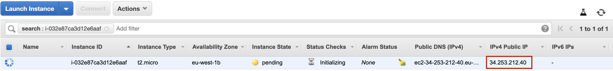
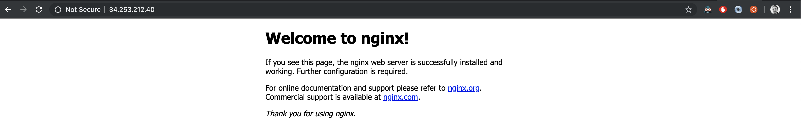
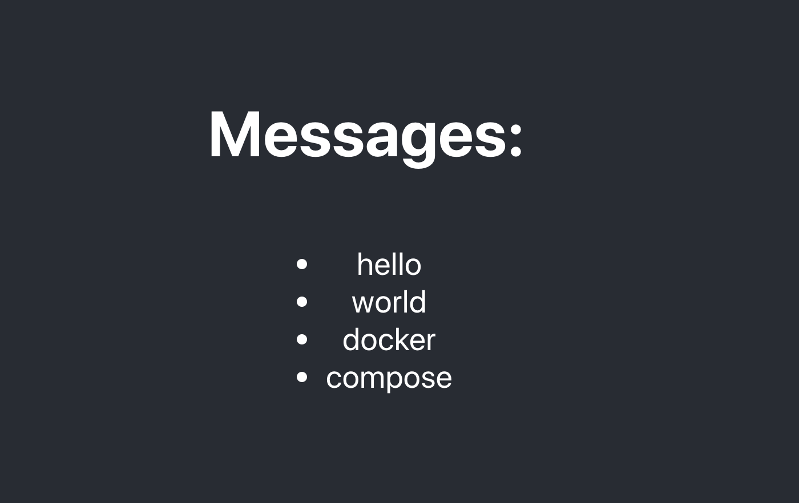

# TP - Mettre un site en ligne sur une instance AWS EC2

## Les notions à connaître:

- Adresses IP et ports
- Résolution DNS (et fichier `/etc/hosts`)
- Connexion distante avec `SSH`
- Rôle d'un firewall/pare-feu
- Installation de packets système sous Linux
- Configuration d'un service sur Linux et systemd

## Introduction

Dans ce TP, vous allez apprendre le `hard way` pour mettre en ligne un site web, en passant par des instances (serveurs virtualisés) d'un Provider Cloud (il est évidemment possible de reproduire ce TP sur serveur dédié).

Ici, nous allons nous baser sur le Cloud Provider `Amazon Web Services` puisqu'il propose un système de `Free Tier` permettant aux étudiants de se former gratuitement sur leurs solutions.

Assurez vous d'avoir [créer un compte sur la console AWS](console.aws.amazon.com) avant toute chose.

Cela vous permettra de vous approprier les `bases` de la mise en ligne d'un application web sur un serveur Linux, la complexité (le début) liée à la gestion de cette infrastructure.

Cela vous permettra de comprendre ce qu'il se passe potentiellement sur une plateforme de production typiquement dans vos entreprises. 

Par la suite, vous serez en mesure d'assimiler les contraintes et bénéfices d'utiliser des offres `managées` comme Heroku, Firebase, Netlify et bien d'autres que nous verrons plus tard dans le cours. Ces offres font abstraction de cette notion de serveur (et de la gestion de ceux-ci)  pour vous proposer un moyen rapide de déployer et configurer vos applications (ainsi que de faire le suivi de celle-ci) et peuvent s'avérer être une grande victoire lorsqu'on souhaite livrer un produit rapidement, en évitant la complexité.

## Première Partie: Héberger un site web sur EC2

Tout d'abord:
- Connectez-vous à la console AWS
- Choisir le produit EC2

Avant de créer notre instance et de nous connecter dessus, nous allons avoir besoins de configurer plusieurs points:
- Les paires de clés, générées par `AWS` pour pouvoir se connecter à distance avec le protocole SSH
- La configuration réseau, pour sécuriser la connexion à distance et autoriser uniquement le traffic entrant sur les services non sensible.

### Configuration de la clé (Pour se connecter sur le serveur à distance):

Pour pouvoir se connecter à distance, on peut utiliser le protocole `SSH`, pour ce faire il va nous falloir générer une clé.
Chaque Provider Cloud propose une stratégie différente pour s'authentifier au serveur via SSH:
- En temps normal, on aura pu générer une clé avec la commande suivante:
```bash
ssh-keygen -t rsa -b 4096
```
- Avec AWS, le mécanisme est le suivant: `Les sont générés et stockés par Amazon, dans l'onglet "Paires de clés" de la console EC2, on génère une clé sur la console, on télécharge en local une des clés. On va ensuite indiquer à l'instance que l'on souhaite utiliser cette clé-ci pour s'authentifier`.

Allez donc dans la section `paire de clé`, et créez en une nouvelle, appelez-la `tp-aws`, et téléchargez la sur votre ordinateur.

### Configuration réseau

Ici, nous allons voir une partie importante concernant la sécurité de notre instance et des services exposés dessus à l'avenir. Nous allons utilisé les `groupes de sécurité`, qui permettent de configurer le `Firewall/pare-feu` de l'instance. Cela nous permettra de choisir minutieusement quels ports de l'instance seront exposés pour quelles addresses.

Typiquement, pour laisser l'accès à un site Web (`HTTP` sur les ports 80 et 443 pour `HTTPS`) exposé sur une instance, nous allons autoriser toutes les addresses IP (`0.0.0.0`) à accéder aux ports `80` et `443` avec le protocole `TCP`.

Voici donc les instructions:
- Créez un nouveau groupe de sécurité, appelez-le `tp-aws`
- Le port 22 doit être accessible (pour le SSH)
- Le port 80 doit être accessible, puisque nous allons installer un serveur web par la suite.


### Création de l'instance

Maintenant que nous avons configuré les différentes ressources qui vont nous permettre de travailler sur cette instance, nous allons pouvoir passer à la partie Machine Virtuelle:
- Allez dans l'onglet `Instances` de la console EC2.
- Créez une nouvelle instance
- Sélectionnez l'OS `Ubuntu 18.04`, puis le type `t2.micro`, cela vous permettra d'effectuer le TP sans dépenser d'argent.
- Configurez la section réseau pour utiliser le `Groupe de Sécurité` crée précédemment
- Validez la création de l'instance, pensez à choisir la clé `tp-aws` crée précédemment.
- L'instance devrai à présent être en cours de création, nous allons pouvoir nous y connecté, une fois l'adresse IP assignée. Veuillez Copier l'adresse IP de votre instance:
  

  ### Connexion à l'instance

  Vous allez maintenant vous connecter à l'instance depuis votre machine.

  Pour cela, vous devez au préalable avoir téléchargé la clé générée par `AWS`.

Veuillez dans un premier temps localiser la clé dans votre système (dans les téléchargements à priori).

La commande `ssh -i <chemin-vers-la-clé> <user>:<host>` nous permet d'initialiser une session SSH pour nous connecter à un serveur distant.

Si on essaie de se connecter à l'instance avec cette clé actuellement (Ici, on se connecte sur l'utilisateur `ubuntu`, crée par Amazon pour nous, administrateurs):
```bash
ssh -i ~/.ssh/masselot_demo.pem ubuntu@34.253.212.40

@@@@@@@@@@@@@@@@@@@@@@@@@@@@@@@@@@@@@@@@@@@@@@@@@@@@@@@@@@@
@         WARNING: UNPROTECTED PRIVATE KEY FILE!          @
@@@@@@@@@@@@@@@@@@@@@@@@@@@@@@@@@@@@@@@@@@@@@@@@@@@@@@@@@@@
Permissions 0644 for '/Users/antoinemasselot/.ssh/masselot_demo.pem' are too open.
It is required that your private key files are NOT accessible by others.
This private key will be ignored.
Load key "/Users/antoinemasselot/.ssh/masselot_demo.pem": bad permissions
ubuntu@34.253.212.40: Permission denied (publickey).
```

Ici, on nous prévient que les permissions alloués au fichier (contenant la clé) sont trop importantes, il va falloir les réduire pour uniquement autoriser la lecture de cette clé par l'utilisateur en cours:
```bash
chmod 600 ./chemin/vers/la/clé.pem
```

Ensuite, connectez vous à votre instance, avec la commande `ssh`.

### Installation de packets système: Serveur Web nginx

Vous allez à présent installer des packets systèmes sur votre instance, à savoir le packet `nginx`, qui va nous servir de serveur Web pour héberger notre site statique.

La commande `apt-get` permet de gérer les packets système sur l'OS `Ubuntu` (Linux) que nous avons installé sur notre instance précédemment.
```bash
# Met à jours les packets disponibles au téléchargement
apt-get update
# Installe un packet en particulier
apt-get install -y <le-packet>
```

**Petite précision: la gestion de packet doit être 

**Avec cette commande, veuillez installer le packet `nginx`**

Une fois l'installation terminée, vérifiez que le serveur web est actif avec la commande:
```bash
systemctl status nginx
```

**Petite explication par rapport à la commande systemctl**: [systemd](https://fr.wikipedia.org/wiki/Systemd) nous permet de configurer les services présents sur notre machine (ici, `nginx` par exemple) pour s'assurer qu'il sera exécuter correctement celon une configuration donnée. Lorsqu'on installe un packet sur une machine `Ubuntu`/`Debian`, ce packet est souvent installé avec une configuration `systemd` (comme ici nginx).
La commande `status` nous permet de suivre l'état du service concerné.

Le chemin vers le fichier de configuration du service est divulgué en résultat de la commande `systemctl status`.

Dans la configuration par défaut utilisée lors de l'installation, le serveur Web `nginx` est accessible sur le port 80.

Vous pouvez donc tester votre installation à l'aide de la commande curl (effectue une requête HTTP):
```bash
curl localhost:80
# Affiche le contenu du fichier index.html localisé à la racine du serveur web
<!DOCTYPE html>
<html>
<head>
<title>Welcome to nginx!</title>
<style>
    body {
        width: 35em;
        margin: 0 auto;
        font-family: Tahoma, Verdana, Arial, sans-serif;
    }
</style>
</head>
<body>
<h1>Welcome to nginx!</h1>
<p>If you see this page, the nginx web server is successfully installed and
working. Further configuration is required.</p>

<p>For online documentation and support please refer to
<a href="http://nginx.org/">nginx.org</a>.<br/>
Commercial support is available at
<a href="http://nginx.com/">nginx.com</a>.</p>

<p><em>Thank you for using nginx.</em></p>
</body>
</html>
```

Vous pouvez voir la configuration du serveur web dans `/etc/nginx/sites-enabled/default`:
```bash
cat /etc/nginx/sites-enabled/default
# Affiche le contenu suivant:
server {
	listen 80 default_server;
	listen [::]:80 default_server;

	# SSL configuration
	#
	# listen 443 ssl default_server;
	# listen [::]:443 ssl default_server;
	#
	# Note: You should disable gzip for SSL traffic.
	# See: https://bugs.debian.org/773332
	#
	# Read up on ssl_ciphers to ensure a secure configuration.
	# See: https://bugs.debian.org/765782
	#
	# Self signed certs generated by the ssl-cert package
	# Don't use them in a production server!
	#
	# include snippets/snakeoil.conf;

	root /var/www/html;

	# Add index.php to the list if you are using PHP
	index index.html index.htm index.nginx-debian.html;

	server_name _;

	location / {
		# First attempt to serve request as file, then
		# as directory, then fall back to displaying a 404.
		try_files $uri $uri/ =404;
	}

	# pass PHP scripts to FastCGI server
	#
	#location ~ \.php$ {
	#	include snippets/fastcgi-php.conf;
	#
	#	# With php-fpm (or other unix sockets):
	#	fastcgi_pass unix:/var/run/php/php7.0-fpm.sock;
	#	# With php-cgi (or other tcp sockets):
	#	fastcgi_pass 127.0.0.1:9000;
	#}

	# deny access to .htaccess files, if Apache's document root
	# concurs with nginx's one
	#
	#location ~ /\.ht {
	#	deny all;
	#}
}


# Virtual Host configuration for example.com
#
# You can move that to a different file under sites-available/ and symlink that
# to sites-enabled/ to enable it.
#
#server {
#	listen 80;
#	listen [::]:80;
#
#	server_name example.com;
#
#	root /var/www/example.com;
#	index index.html;
#
#	location / {
#		try_files $uri $uri/ =404;
#	}
#}
```
Ici, on va se préoccuper de la variable `root` => `/var/www/html`. On va donc pouvoir ajouter notre site statique à cet endroit par la suite.

**Maintenant, pour vérifier que la configuration réseau a été effectuée correctement, ouvez votre navigateur préféré et tapez l'adresse IP de votre machine**, vous devriez constater le résultat suivant:


Si ce message n'apparait pas, où que vous constatez une connexion refusée, la configuration de votre `Groupe de sécurité` n'est pas correct, retournez dans la console Amazon et assurez vous que le port `80` est ouvert sur l'IP `0.0.0.0` (accessible par tout internet) avec le protocole TCP.

### Mettre en ligne notre site Web.

Ici, nous allons utiliser [ce repository Github](https://github.com/AmFlint/hetic-w2-p2019-05) (Projet Front effectué lorsque j'étais en deuxième année).

Ce projet est développé avec `Webpack`, qui sert à compiler le code (`pug` vers html, scss vers css, minify JavaScript...) en un ensemble de fichiers statiques, que l'on va par la suite exposer derrière un serveur Web (comme `nginx`, que nous avons configuré précédemment).

Voici le rendu final que nous cherchons à atteindre, une fois mis en ligne sur notre instance:


[Les fichiers statiques du site en question se trouvent ici](./website), vous devrez donc télécharger ce repo sur votre ordinateur, puis archiver et uploader le contenu de ce dossier sur votre serveur distant:
```bash
# La commande zip permet de créer une archive au format ZIP à partir de fichiers/dossiers donnés
# zip -r <nom-de-larchive-a-crée>.zip <nom-du-dossier-a-archiver>
zip -r website.zip website
# L'option "-r" permet d'inclure les fichiers présents dans un dossier. Autrement, seul un dossier vide aurai été archivé.
```

Nous allons à présent utiliser la commande `scp` pour envoyer les fichier statiques (archivé) du site sur notre instance.


`scp` fonctionne de la façon suivante:
```bash
# Commande générique
scp -i chemin/vers/clé /chemin/vers/archive <utilisateur>@<hôte>:/chemin/sur/instance

# La commande suivante est chargée d'uploader un fichier archive.zip
# sur la machine avec l'IP 51.121.23.42 en tant qu'utilisateur root
# à l'emplacement /root/mon-site.zip
# en utilisant la clé stockée à ~/.ssh/my_key.pem
scp -i ~/.ssh/my_key.pem ./archive.zip root@51.121.23.42:/root/mon-site.zip
```

On va ensuite pouvoir désarchiver le code source avec la commande `unzip` (vous devrez l'installer via apt).

**Pour cet exercice, je vous demanderai de disposer le dossier contenant le code source à l'emplacement /home/ubuntu/zelda sur l'instance**.

Maintenant, nous allons devoir mettre à jours la configuration de notre serveur web `nginx` pour servir les fichiers statiques, placés dans le dossier `/home/ubuntu/zelda`.

Dans la partie précédente, nous avons vu quel paramètre sert à indiquer à nginx quel dossier doit être utilisé comme racine du serveur web. 

**Veuillez maintenant mettre à jours cette configuration dans /etc/nginx/sites-enabled/default pour pointer sur /home/ubuntu/zelda**.

Lorsque l'on modifie la configuration du service `nginx` (comme beaucoup d'autres services), il faut redémarrer ce service grâce à `systemctl` (que nous avons vu précédemment):
```bash
# les actions sur les services systemd doivent être exécutées en tant que `root` -> sudo
sudo systemctl reload nginx
```

Afin de vérifier que le site est en ligne, veuillez raffraichir votre page du navigateur ouverte sur la page `Welcome to nginx` ouverte précédemment. Vous devriez voir le site Zelda à présent.

Nous allons maintenant configurer un `virtualhost` pour nginx, de sorte à configurer un `nom de domaine` pour notre site (ici, nous allons simuler l'utilisation d'un NDD pour ne pas avoir à en acheter un).

Je vous invite dans un premier temps à mettre à jours la configuration `/etc/nginx/sites-enabled/default`:
```bash
# Sudo parce que ce fichier de configuration ne peut être modifié que par l'utilisateur root (dans un dossier priviliégié)
sudo vim /etc/nginx/sites-enabled/default
```

Une fois la modification effectuée, vous pouvez recharger la configuration du serveur web comme vu précédemment, sinon les changements ne seront pas appliqués. **Assurez vous qu'aucune erreur ne s'affiche, sinon suivez les logs à l'aide de la commande journalctl**.

Ouvrez le site dans votre navigateur, vous devriez voir le site Zelda.

## Deuxième Partie: Déployer une application (Front, Back, Base de donnée):

Pour pouvoir exécuter cette partie, il est vivement recommandé d'avoir effectué la première partie d'abord.

Dans cette partie, vous allez utiliser les compétences que vous avez développées dans la partie précédente pour travailler sur une infrastructure un peu plus complexe.

Nous allons à présent déployer une application avec les composants suivants:
- Base de donnée MySQL, contenant une table `messages` (`id`, `content`) pour stocker des messages.
- API Back-end développée avec node.js et express.js, intéragit avec la base pour lire la liste de messages.
- Front-end développé avec React, intégit avec l'API pour afficher la liste de message dans une interface graphique

Dans ce TP, vous allez:
- Déployer une nouvelle instance EC2, qui servira à héberger une base de donnée MySQL
- Installer node.js, déployer [l'API présente dans ce dossier](./server) sur une nouvelle instance EC2, et la configurer pour intéragir avec notre base de données.
- Déployer l'application front-end et la configurer pour intéragir avec notre API Back-end.

### API Back-end

Vous allez à présent travailler sur une nouvelle instance EC2 pour votre API, veillez à ce que

Côté réseau:
- L'API sera exposée sur le port `3001`

Veuillez créer un nouveau `Security Group` pour ce nouveau type d'instance (API). Vous pouvez dès à présent configurer ce security group pour autoriser la connexion sur le port `3001` à l'instance crée dans la partie 1, puisque le Front que l'on installera dessus devra intéragir avec cette instance qui expose l'API.

Côté configuration, l'API utilise les variables d'environnement suivantes:
- `PORT`: Défini sur quel port de la machine le serveur va écouter
- `DB_HOST`: L'hôte du service MySQL (ou adresse IP)
- `DB_USER`: Utilisateur de la base de donnée (**n'utilisez pas root**)
- `DB_PASSWORD`: Le mot de passe de la base de donnée
- `DB_NAME`: Nom de la base de donnée

**Petit rappel: Pour créer une variable d'environnement utilisable dans une application, on utilise la commande export, comme par exemple**:
```bash
# Créer la variable d'environnement PORT avec la valeur 3000
export PORT=3000
```
Pour lister les variables d'environnements configurées, on utilise la commande suivante:
```bash
env
```

Vous aurez besoins [d'installer nodejs et npm](https://doc.ubuntu-fr.org/nodejs) sur votre instance pour exécuter l'API (écrite en node).

Par la suite, vous devrez uploader [le code de l'api présent ici](./server) sur l'instance à l'aide de la commande `scp`.

Une fois le code sur l'instance, pensez à installer les dépendances de l'application avec `npm install`, vous pourrez lancer l'application avec la commande `npm run start`.

Pour vérifier que notre instance Front-end (déployée dans la première partie) à accés correctement à l'API que nous venons de déployer, nous allons effectuer la démarche suivante:
- Connexion en SSH à l'instance front-end:
	```bash
	ssh ubuntu@<ip-machine-front>
	```
- envoyer une requête HTTP à l'aide de la commande `curl` sur l'API:
	```bash
	curl <ip-api>:3001
	```
	Vous devriez obtenir le résultat suivant:
	```json
	{
		"message": "hello"
	}
	```
	Dans le cas contraire, soit vous n'avez pas configurée l'API sur le port 3001 de l'instance, soit vous n'avez pas correctement configuré le Security group de l'API pour autoriser la machine front sur le port 3001 en TCP.

Dans l'étape suivante, vous allez configurer le serveur de base de données, vous aurez cependant besoins de revenir sur l'instance API pour vous la suite (configuration, et vérifications pour MySQL).

Je vous invite dés à présent à installer le packet `mysql-client` qui vous permettra de tester la connexion à la base de l'instance DB que nous allons configurer.

**L'API que nous venons de lancer sur cette nouvelle instance s'éteindra dès lors que vous quitterez votre session SSH, puisque la tâche (`npm run start`, ou `node server.js`) tourne en `foreground`**. Afin de conserver le serveur node en marche à tout moment nous avons plusieurs solutions:
- [tmux](https://doc.ubuntu-fr.org/tmux): Créer une session Shell détachée, nous permettant d'exécuter des commandes qui continueront de tourner lorsqu'on détachera la session.
- [Les services Linux](https://doc.ubuntu-fr.org/creer_un_service_avec_systemd) (Ici, à l'aide de systemd, que nous avons précédemment avec nginx: `systemctl`). Nous allons pouvoir gérer la configuration de notre processus (et des variables d'environnement) pour faire tourner notre API comme un serveur node, à tout moment.

Ici, nous utiliserons `les services Linux avec systemctl`.

Pour déclarer un service, il faut créer un fichier sur notre instance à l'emplacement `/etc/system/system/<nom-du-service>.service`, avec la syntaxe suivante:
```
# Configuration principale de notre service
[Service]
# Variables d'environnements à utiliser dans le service
Environment="NOM_DE_MA_VARIABLE=valeur"

# Suites de commande à exécuter pour chacun des états du service:
# Ici, cette commande sera exécutée lorsqu'on appellera systemctl start mon-service
ExecStart=<command>
# La commande suivante sera exécutée lorsqu'on appellera systemctl stop mon-service
ExecStop=<command>
```

Grâce à ce système de service, nous allons pouvoir configurer notre API Back-end. Je vous invite donc à créer un nouveau fichier `/etc/systemd/system/backend.service`, et y renseigner les différentes options nécessaires à la configuration de l'API à savoir:
- Les variables d'environnements avec la clé `Environment` (voir la liste de variables au-dessus).
- La commande `ExecStart` qui sera chargée de démarrer le serveur node.
- La commande `Restart=on-failure` qui sera chargée de relancer le service lorsque celui ci rencontrera une erreur.

Une fois ce nouveau fichier crée, vous devrez indiquer à systemd que la configuration a été modifiée (vous venez d'ajouter un service):
```bash
# Notifie systemd que la configuration a été modifiée, et qu'il faut donc la prendre en compte
sudo systemctl daemon-reload
# Démarrer le nouveau service que vous venez de créer
sudo systemctl start backend
# Vérifier l'état du service
sudo systemctl status backend
● backend.service
   Loaded: loaded (/etc/systemd/system/backend.service; static; vendor preset: enabled)
   Active: active (running) since Sun 2019-10-13 13:51:28 UTC; 11min ago
 Main PID: 2320 (node)
    Tasks: 6 (limit: 1152)
   CGroup: /system.slice/backend.service
           └─2320 /usr/bin/node /home/ubuntu/server/server.js

Oct 13 13:51:28 ip-172-31-12-191 systemd[1]: Started backend.service.
Oct 13 13:51:29 ip-172-31-12-191 node[2320]: Listening on http://localhost:3001
Oct 13 13:51:43 ip-172-31-12-191 node[2320]: GET / 200 4.250 ms - 19
```

**Notez que si vous modifier plusieurs fois le fichier, il faut relancer `systemctl daemon-reload` pour prendre en compte la dernière version de la configuration**.

### MySQL

Dans un premier temps, nous allons installer `MySQL` sur une nouvelle instance EC2.

Côté réseau (`Security Groups`):
- MySQL est exposé par défault sur le port `3306`

Veuillez créer un security group à part, et appelez le `database`, autorisez la connexion sur le port `22` en `SSH` pour pouvoir se connecter puis configurer le serveur par la suite. **Notez que vous devrez mettre à jours le security group database plus tard dans l'exercice pour sécuriser la connexion entre l'API et la base de donnée**.

Je vous invite à lire les documentations suivantes pour installer les différents composants nécessaires sur votre instance:
- [MySQL](https://doc.ubuntu-fr.org/mysql)

**Pour des raisons de sécurité, nous allons créer un nouvel utilisateur pour la base de donnée, en ajustant ses permissions, pour lui donner les droits que sur une base**, [référez-vous à la documentation sur comment créer un utilisateur et lui allouer des permissions](https://linuxize.com/post/how-to-create-mysql-user-accounts-and-grant-privileges/):
- Créez une base de donnée `infra`
- Créez un utilisateur du nom de `infrauser` avec le password `infrapassword` **faites attention, vous devrez spécifier l'addresse IP avec laquelle ce nouvel utilisateur sera utilisé**, prenez donc l'IP de votre API (Puisque nous nous connecterons à la base MySQL depuis l'instance API).
- Donnez les permissions (all privileges) à cet utilisateur sur la base `infra` (et toutes ses tables).
- À présent nous utiliserons cette utilisateur pour intéragir avec la base.

**Cependant, ce n'est pas tout, si j'essaie de me connecter depuis mon instance API sur ma DB, je reçois le message d'erreur suivant**:
```bash
# Commande
telnet <ip-db> 3306
# Output
Connection refused
```
La commande telnet permet de tester la connexion à un port précis sur un hôte (Ici, on vérifie qu'on a bien accès au port 3306 => mysql de l'instance DB depuis notre instance API).

La raison est simple: Le service `MySQL` est configuré pour n'autoriser que la connexion sur l'IP local (127.0.0.1).

Vous allez donc devoir configurer le fichier `/etc/mysql/mysql.conf.d/mysqld.cnf`: Le paramètre `bind-address`. **Pour autoriser la connexion au service MySQL sur toutes les interfaces réseaux de la machine (Par l'adresse IP publique notamment), il faut utiliser l'adresse `0.0.0.0`). N'oubliez pas de restart votre service mysql avec systemctl restart mysql**.

Une fois MySQL installé sur votre instance, vous pouvez utiliser [ce fichier database.sql](./database.sql) contenant la structure de la base de données à utiliser pour cette exercice. Pour ce faire, vous devrez d'abord uploader le fichier database.sql sur votre instance Database avec la commande `scp` que nous avons vu précédemment.

Par la suite, il faudra importer la structure décrite dans le fichier database.sql dans la base de donnée, à l'aide de la commande `mysql` sur l'instance directement (Utilisez votre nouvel utilisateur):
```bash
mysql -u <user> -p<password> <database-name> < database.sql
```
Cette commande aura pour effet d'importer le fichier database.sql dans la base de donnée sélectionnée, en se connectant avec les identifiants `user` et `password`.

**Une fois la base de données initialisée, pensez à configurer votre API avec les différentes variables d'environnements listées au-dessus, puis relancer le serveur node.**

Puis essayez de joindre votre API depuis votre instance FRONT, dans mon cas:
```bash
ubuntu@ip-172-31-29-133:~$ curl 34.243.177.14:3001/messages
[{"id":1,"content":"hello"},{"id":2,"content":"world"},{"id":3,"content":"docker"},{"id":4,"content":"compose"}]
```

Ici, on peut attester que l'API a bel et bien accès à la base MySQL, puisqu'on peut lire la liste de messages ici.

### Front-End

Dans le cadre de notre application Front, nous utilisons React, avec `create-react-app`, [veuillez vous référer à leur documentation](https://create-react-app.dev/docs/adding-custom-environment-variables) concernant la configuration avec variables d'environnement. Pour résumer, on peut utiliser des variables d'environnement dans notre application, il faudra simplement les renseigner (`export MAVARIABLE=VALEUR`) au moment de build le code. Et les références à `process.env.MAVARIABLE` dans le code seront remplacés par la valeur de cette variable (dans cet exemple: VALEUR).

Vous devrez donc lancer le build (`npm run build`) sur votre machine une fois que vous connaitrez le endpoint de votre API (`http://<ip-api>:3001`) avec la variable:
```bash
export REACT_APP_BACKEND_URL=http://<ip-api>:3001
```

Utilisez ensuite la commande `npm run build` dans le [dossier client](./client) pour créer un dossier build contenant l'application finale, à déployer sur le serveur Front.

Vous pourrez utiliser les commandes `zip` et `scp` sur votre machine puis `unzip` sur votre instance.

Je vous invite à configurer votre serveur nginx pour utiliser une configuration par défault, pointant sur le nouveau dossier contenant les fichiers statiques buildés.

Ensuite, rendez-vous dans votre navigateur sur l'adresse IP de votre instance FRONT, où vous devriez observer le résultat suivant:
.

Vous pouvez vous amuser à modifier le contenu de votre base de données, vous verrez le résultat se mettre à jours sur votre navigateur.

## Partie Bonus

Dans cette partie, nous allons continuer sur l'infrastructure de la partie précédente:
- Front
- Back
- Base de données

Et nous allons ajouter deux composants (Voir documentation ci-jointe pour l'installation de RabbitMQ):
- [Un Bus de messages (Ici, RabbitMQ)](https://www.rabbitmq.com/install-debian.html)
- [Un `Worker` pour le back-end](./server/worker.js).

Nous allons toucher ici à un système distribué, le principe est simple: l'API Back-End, va déléguer une partie de son travail à des `Workers`, qui attendent des évènements, et effectuent des actions en conséquence.

Les évènements sont émis par l'API principale, à travers un bus de messages, ici `RabbitMQ`. Ces messages (évènements) sont en suite redistribués à des `Workers`, qui sont eux-aussi connectés au bus de messages.

Dans le cadre de cet exercice:
- Le Worker, lors de son initialisation va se connecter à un serveur RabbitMQ pour `écouter` les évènements.
- Dans l'API, sur une requête `POST /messages` (`body: { message: string }`): dont l'objectif est de créer un nouveau message dans la base de données. L'API créera un évènement dans RabbitMQ, avec le message défini par l'utilisateur.
- Le worker va ensuite `dépiler` cet évènement pour effectuer une action: `Créer un message en base de données`.

Le worker a donc besoins des variables d'environnement suivantes:
- `AMQP_URL`: URL vers le service AMQP (contenant aussi user et password)
- `DB_HOST` (Voir les variables du back-end dans la section API plus haut).
- `DB_USER`
- `DB_PASSWORD`
- `DB_NAME`

Le `Worker` peut être démarré avec la commande `npm run worker`.

**Pour cet exercice, vous créerez une nouvelle instance sur laquelle vous installerez RabbitMQ. Le Worker tournera sur la même instance que l'API Back-End**.

Veuillez utiliser les `services Linux` (via SystemD) pour configurer le `Worker`.

Pensez bien au niveau des groupes de sécurité que seul l'instance d'API doit être en mesure d'accéder à l'instance RabbitMQ.

Pour vérifier que tout fonctionne bien:
- Envoyez une requête curl sur votre API
	```bash
	# Sur l'instance API
	curl -X POST localhost:3001/messages -d '{"message": "testing"}'
	# Cette commande doit vous répondre:
	{"message":"testing"}
	# ce qui veut dire que l'API a bien pris en compte la demande de création d'un message testing, et que l'évènement a été empilé dans RabbitMQ.

	# Vérifiez ensuite que le message a bien été ajouté en base
	curl localhost:3001/messages
	```
- Mettez à jours le Front (J'ai effectué des modifications pour ajouter la fonctionnalité de création de messages), pensez à correctement rebuild le code: `npm run build` (En ayant pensé à définir la variable d'environnement `REACT_APP_BACKEND_URL` pour pointer sur l'adresse de l'API). Connectez vous le front depuis votre navigateur et ajoutez des messages depuis le formulaire.
