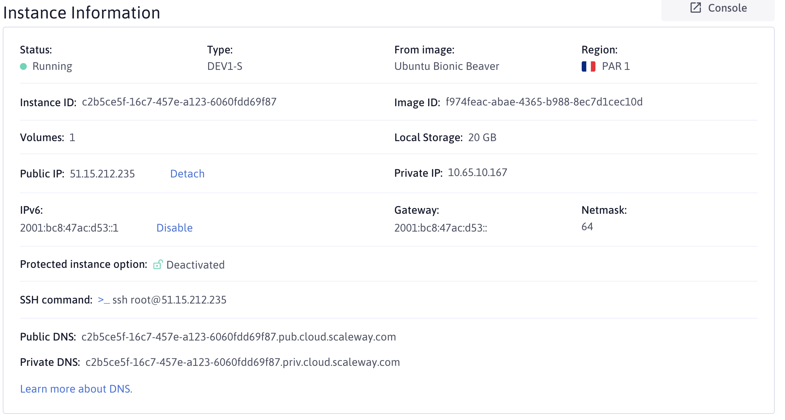

# TP - Cloud w/ Docker

Dans ce TP, nous verrons comment travailler avec des instances (Machines Virtuelles) dans le cloud pour configurer un serveur avec Linux, et déployer nos images Docker.

**Les objectifs**:
- Se familiariser avec l'environnement Cloud basique pour configurer un serveur
- Utiliser les connaissances acquises lors de la [formation Docker](https://github.com/AmFlint/courses-docker) pour déployer une application conteneurisée dans un contexte de production

**L'application**:
- Base de données MySQL
- API Back-end écrite en node.js avec Express: Lister et créer des messages dans la base de données.
- Un client (Front-End), écrit avec React, se connecte à l'API pour afficher et créer des messages dans une interface graphique.

## Pré-requis

- Créez un compte sur [AWS](https://aws.amazon.com/fr/).
- [Installez Docker sur votre ordinateur](http://github.com/AmFlint/courses-docker/tree/master/tp-install-docker)

## Installer et configurer un serveur Linux

Dans cet exercice, nous apprendrons à travailler sur Linux (ici, Ubuntu), sur la plateforme AWS (Amazon Web Services).

### Préparer le terrain: connexion avec `SSH`

Pour se connecter à un serveur distant, il faut utiliser la commande SSH (`Secure SHell`), qui nous permet d'initialiser une session Shell sur un ordinateur à distance (ici, notre machine virtuelle dans un Data Center).

Pour se connecter à une instance distante, SSH utilise un système de clés:
- Une clé publique, que l'on va renseigner à notre serveur (ici, à AWS qui va installer la clé sur le serveur)
- Une clé privée, que l'on doit garder secrète (uniquement sur notre ordinateur), et que l'on va utiliser pour se connecter à un serveur distant.

- Votre ordinateur va se connecter sur le port 22 (par défaut) à un serveur distant: `Voici ma clé privée`
- Le serveur va vérifier qu'il possède une clé publique, liée à la clé privée reçue
  - Si aucune clé ne correspond: `connexion refusée`
  - Si une clé correspond: `connexion acceptée`, vous êtes connectés au serveur.

Pour générer une pair de clé (toujours par paire: privée et publique), on utilise la commande `ssh-keygen`:
```bash
# -t => type d'algorythme utilisé pour générer la clé, ici on utilise RSA
# -b => Taille en bytes/octets de la clé => Ici 4 Ko
ssh-keygen -t rsa -b 4096
```
La commande ssh-keygen va vous poser plusieurs question, notamment l'emplacement sur votre système où vous souhaitez installer la clé, le mot de passe que vous souhaitez utiliser (facultatif) etc...

Par exemple:
```bash
➜  ~ ssh-keygen -t rsa -b 4096

Generating public/private rsa key pair.
Enter file in which to save the key (/Users/antoinemasselot/.ssh/id_rsa): /Users/antoinemasselot/.ssh/test_hetic_w3
Enter passphrase (empty for no passphrase):
Enter same passphrase again:
Your identification has been saved in /Users/antoinemasselot/.ssh/test_hetic_w3.
Your public key has been saved in /Users/antoinemasselot/.ssh/test_hetic_w3.pub.
The key fingerprint is:
SHA256:vx9Jt2uN/C5uTQTr6DFmMzRQc5otD9i7YNXP4TfzNKA antoinemasselot@Antoines-MacBook-Pro-2.local
The key's randomart image is:
+---[RSA 4096]----+
|           .o .  |
|          .o B.  |
|          ..B.o+ |
|           .+=+oo|
|        S oEo+o*=|
|         o oO+.oB|
|          .++*.=.|
|           ...*.o|
|          ...+o+o|
+----[SHA256]-----+
```
J'ai généré une paire de clé à l'emplacement `/Users/antoinemasselot/.ssh/test_hetic_w3`, sans mot de passe, et j'ai obtenu deux nouveaux fichiers:
- /Users/antoinemasselot/.ssh/test_hetic_w3.pub => `clé publique`
- /Users/antoinemasselot/.ssh/test_hetic_w3 => `clé privée`

Ensuite, nous allons devoir renseigner le contenu la clé `publique` (.pub), à notre Provider (ici AWS), afin de pouvoir utiliser la clé privée, pour s'identifier à notre serveur plus tard dans le TP.

Pour ce faire, connectez vous sur la console AWS, choisissez le service `EC2`, et déplacez vous dans l'onglet `Key Pair` ou `Paire de clés` dans le menu à gauche.

Vous pourrez importer une clé (bouton en haut à droite), c'est à dire télécharger le contenu de votre fichier.

**Partie à effectuer pour le TP**:
- Générer une paire de clé (`ssh-keygen`), appelez-la comme vous souhaitez
- Copier le contenu de la clé publique (fichier avec l'extension `.pub`)
- Allez sur l'interface `EC2 Import Key Pair` d'AWS pour y importer votre clé publique

Une fois cette partie correctement effectuée, nous allons passer au démarrage du serveur.

### Configuration réseau

Ici, nous allons voir une partie importante concernant la sécurité de notre instance et des services exposés dessus à l'avenir. Nous allons utilisé les `groupes de sécurité`, qui permettent de configurer le `Firewall/pare-feu` de l'instance. Cela nous permettra de choisir minutieusement quels ports de l'instance seront exposés pour quelles addresses.

Typiquement, pour laisser l'accès à un site Web (`HTTP` sur les ports 80 et 443 pour `HTTPS`) exposé sur une instance, nous allons autoriser toutes les addresses IP (`0.0.0.0`) à accéder aux ports `80` et `443` avec le protocole `TCP`.

Voici donc les instructions:
- Créez un nouveau groupe de sécurité, appelez-le `tp-aws`
- Le port 22 doit être accessible (pour le SSH)

### Création de l'instance

Maintenant que nous avons configuré les différentes ressources qui vont nous permettre de travailler sur cette instance, nous allons pouvoir passer à la partie Machine Virtuelle:
- Allez dans l'onglet `Instances` de la console EC2.
- Créez une nouvelle instance
- Sélectionnez l'OS `Ubuntu 18.04`, puis le type `t2.micro`, cela vous permettra d'effectuer le TP sans dépenser d'argent.
- Configurez la section réseau pour utiliser le `Groupe de Sécurité` crée précédemment
- Validez la création de l'instance, pensez à choisir la clé `tp-aws` crée précédemment.
- L'instance devrai à présent être en cours de création, nous allons pouvoir nous y connecté, une fois l'adresse IP assignée. Veuillez Copier l'adresse IP de votre instance:
  

<!-- ### Démarrer un serveur

Ici, nous allons apprendre à configurer et démarrer une Machine Virtuelle (VM) dans le Cloud.

**Partie à effectuer pour le TP**:
- Dans l'onglet `Instances`, cliquez sur le bouton `Create an Instance`
- Pour la configuration:
  - Sélectionnez l'image `Ubuntu`: Système d'exploitation installé sur votre instance
  - Sélectionnez `Paris` comme région: Il s'agit du pays où votre instance sera démarée
  - Sélectionnez le type d'instance `DEV1-S` (onglet `Development`), il s'agit de la puissance de votre serveur (CPU, Mémoire et Stockage)
  - Ne touchez pas la partie `Volumes`, il s'agit du stockage alloué à notre serveur
  - Créez votre instance (en bas).

Une fois l'instance prête, une `adresse IP` est assignée (**Public IP**):


Vous pouvez ensuite copier votre IP, vous rendre dans votre terminal et vous connecter au serveur avec la commande SSH, que nous allons voir dans le prochain point. -->

### Se connecter à un serveur distant avec `SSH`

Rappelons les étapes précédentes:
- Création d'une paire de clés SSH
- Renseignement de la clé PUBLIQUE générée précédemment dans la console AWS
- Création d'une instance, qui utilise la clé générée.

Nous allons maintenant pouvoir nous connecter à notre instance avec la commande `ssh`:
```bash
# -i => Chemin vers le fichier comprenant la clé privée
# <user>: l'utilisateur sur lequel on souhaite se connecter sur le serveur distant
# <host>: Hôte (adresse IP ou Nom de Domaine) du serveur
ssh -i /chemin/vers/la/clé/privée <user>@<host>

# Exemple, avec les données du cours ci-dessus:
ssh -i /Users/antoinemasselot/.ssh/test_hetic_w3 ubuntu@34.252.212.40
```

**Partie à effectuer pour ce TP**:
- Utilisez la commande `ssh` pour vous connecter à votre serveur distant:
  - `-i` pour préciser le chemin vers la clé que vous avez crée précédemment
  - `ubuntu`: L'utilisateur sur le serveur sur lequel vous devez vous connecter. Par défaut, AWS nous créer un utilisateur `ubuntu`, sur lequel nous pouvons nous connecter pour administrer le serveur.
  - `adresse IP de votre serveur`: utilisez l'adresse IP de votre instance, renseignée dans les informations après avoir crée votre serveur.

### Installer les logiciels/librairies nécessaires

Une fois le serveur démarré, il nous faut ensuite installer les logiciels nécessaire pour exécuter nos applications. Par exemple, si nous souhaitons héberger une application écrite en `ruby`, il faudra installer le packet `ruby`.

Dans ce TP, nous utiliserons Docker, puisque nous avons travaillé dessus lors d'une précédente formation.

Pour installer des packages sur un système, on utilise un [Package Manager](https://fr.wikipedia.org/wiki/Gestionnaire_de_paquets) (par exemple, npm et composer sont des gestionnaires de packets). Chaque système d'exploitation possède son propre gestionnaire de packet:
- Chocolatey pour Windows
- HomeBrew pour MacOS
- APT pour Ubuntu et Debien
- Yum pour Red Hat Enterprise Linux et CentOS
- ...

Ici, nous avons installé un système d'exploitation `Ubuntu`, nous utiliserons donc la commande `apt` pour installer nos packages:
```bash
# Mettre à jours le registre local, pour que notre système sache quel packet on peut installer et comment l'installer
apt update
# Ensuite, on peut installer un package avec la commande install
apt install <nom-du-packet>
```

**Notez que ces commandes doivent être exécutées en tant qu'administrateur (root, sudo sur Linux)**, il faudra donc préfixer les commandes `apt` par la commande `sudo` pour exécuter `apt` en tant qu'administrateur.

Pour obtenir des informations sur un package, et notamment comment l'installer, on va se référer à la documentation du packet, très simplement: `rechercher "install nodejs ubuntu" sur google`.

Par exemple, pour [installer node.js et npm sur Ubuntu](https://doc.ubuntu-fr.org/nodejs):
```bash
sudo apt install nodejs npm
```

Comme dit précédemment, nous installerons [Docker ici, en suivant la documentation officielle](https://docs.docker.com/install/linux/docker-ce/ubuntu/)

**Partie à effectuer pour le TP**:
- Installer [Docker for Ubuntu](https://docs.docker.com/install/linux/docker-ce/ubuntu/) sur votre serveur
- Vérifiez l'installation de docker avec la commande `docker run hello-world`

### Packager l'application

Maintenant que nous avons installé les différentes librairies nécessaires pour lancer nos applications sur Docker, nous allons nous concentrer sur la création d'images Docker, à partir du code fournis dans ce TP:
- [Front](./client) avec React
- [Back](./server) avec Node.js et Express

Nous avons vu à plusieurs reprises comment créer une image à partir d'une application, [notamment dans le TP vu en cours](https://github.com/AmFlint/courses-docker/tree/master/tp-images). Je vous invite à revoir ce TP/Cours.

#### Back

Pour fonctionner, le back-end se connecte à une base de données MySQL (nous déploierons un container MySQL sur notre serveur dans les étapes à venir).

On peut configurer l'application back avec les variables d'environnements suivantes:
```
DB_HOST: Hôte du serveur de bdd (exemple: 127.0.0.1)
DB_USER: Utilisateur de la base de données
DB_PASSWORD: Mot de passe de l'utilisateur
DB_NAME: Nom de la base à utiliser
```
Nous nous soucierons de la configuration de ces variables d'environnement plus tard, au moment de lancer l'application sur notre serveur.

**Pour construire l'image Docker Back**:
- Étendre l'image de base `node:alpine`
- Copy le fichier package.json et installer les dépendances
- Copy le code source de l'application
- Spécifier la commande (CMD) principale du container: `node server.js`

#### Front

Le front va se connecter à l'application Back-End grâce à une variable d'environnement `REACT_APP_BACKEND_URL`, avec le format de l'exemple suivant `http://localhost:3000`.

**Petit rappel concernant les variables d'environnement dans une application Front**: Le code JavaScript (React, Vue, Angular ...) est exécuté dans le navigateur de vos utilisateurs, et n'a donc pas accès aux variables d'environnement du serveur (`process.env.${variable}`). Pour offrir de la flexibilité aux développeurs sur la configuration de leur application Front, les outils tels que Webpack vont remplacer en dur dans le code compilé (html, js) les appels à `process.env.${variable}` par le contenu de la variable d'environnement `variable` spécifiée au moment de build le code.

Par exemple, regardons ensemble le [code source de l'app en React de ce TP](./client/src/App.js):
```javascript
const BACKEND_URL = process.env.REACT_APP_BACKEND_URL || 'http://localhost:3000';
```
Lorsque l'on va construire notre application dans une image Docker, il faudra spécifier la variable d'environnement REACT_APP_BACKEND_URL. Le contenu de cette variable sera utilisé pour construire le code finale. Pour ce faire, on peut utiliser la directive `ARG` dans un Dockerfile:
```Dockerfile
# les variables définies par ARG sont automatiquement injectées comme variables d'environnement lors du build de l'image
ARG REACT_APP_BACKEND_URL
```
Puis, on pourra spécifier le contenu de cette variable au moment de build:
```bash
# Ici, je prend l'exemple avec l'adresse IP de mon serveur, utilisé dans l'exemple plus haut à la création de l'instance sur AWS
docker build --build-arg REACT_APP_BACKEND_URL=http://34.252.212.40:3000 .
```

**Autre point important**: Lorsque des appels HTTP sont effectués depuis une application Front (ici, notre app React envoie des requêtes à notre API Back-End, spécifiée par la variable REACT_APP_BACKEND_URL comme vu plus haut), ces appels sont exécutés depuis l'ordinateur de l'utilisateur, et non pas depuis le serveur qui héberge le front.

C'est pourquoi dans l'exemple ci-dessus, je spécifie l'adresse IP de mon serveur AWS, sur le port sur lequel je souhaite faire tourner mon application, plus tard dans l'exercice.

Ici, vous aurez besoins d'utiliser un build à `2 étapes`, comme nous avons pu le voir ensemble sur le [TP Dockerfile de l'application Zelda](https://github.com/AmFlint/courses-docker/blob/master/tp-images/Dockerfile-zelda) ([partie cours ici](https://github.com/AmFlint/courses-docker/tree/master/tp-images)).

**Pour effectuer cette partie du TP**:
- Utilisez l'image de base `node` pour le première étape de build
- Copy package.json, installez les dépendances avec `npm install`, puis Copy le reste du code
- N'oubliez pas de préciser l'`ARG REACT_APP_BACKEND_URL`.
- Buildez l'application avec la commande `npm run build`, un dossier `build` sera crée avec le contenu du code compilé
- Utilisez l'image `nginx:alpine` pour votre seconde étape de build.
- Copiez le code compilé (dossier build) de votre première étape dans `/usr/share/nginx/html` (dossier root de votre serveur web, vu en cours de Docker).

### Uploader les images dans une registry

Au cours de l'étape précédente, vous avez du construire deux images Docker:
- Front-end
- Back-end

Ces images ne sont disponibles que sur votre ordinateur à l'heure actuelle, et nous avoir besoins de les télécharger depuis notre serveur, pour pouvoir les exécuter prochainement.

Pour cela, nous allons devoir stocker ces images dans une `Registry Docker`, afin de les télécharger depuis notre serveur.

**Pour cela, [créez un compte sur Docker Hub](https://hub.docker.com/)**. Docker propose son propre service gratuit de registry, qui va nous permettre de stocker nos images gratuitement pour pouvoir les lancer sur notre serveur par la suite.

Une fois votre compte créer, vous pourrez vous connecter depuis votre terminal avec la commande `docker login`:
```bash
docker login -u <mon-utilisateur>
# par exemple, dans mon cas
docker login -u amasselot
# Docker va ensuite vous demander de taper le mot de passe de votre compte docker hub, si le mot de passe est correct il vous affichera:
Login Succeeded
```

Pour stocker des images sur Docker Hub, il va falloir préfixer votre image docker par votre pseudo, par exemple dans mon cas:
```bash
# Docker tag sert à renommer une image docker sur son ordinateur
# Ici, je renomme l'image nginx:alpine de mon ordinateur en amasselot/nginx:alpine
docker tag nginx:alpine amasselot/nginx:alpine
```

Je peux maintenant `push` (upload) mon image:
```bash
docker push amasselot/nginx:alpine
```

**Pour exécuter cette partie du TP**:
- Créez vous un compte Docker Hub
- Connectez vous à l'aide de la commande `docker login`
- Taggez vos images front et back avec votre pseudo en préfixe, par exemple:
  ```bash
  cd client
  docker build -t amasselot/tp-frontend:latest --build-arg=REACT_APP_BACKEND_URL=http://mon-ip:3000 .
  cd ../server
  docker build -t amasselot/tp-backend:latest .
  ```
- Utilisez la commande `docker push` pour uploader vos images docker sur docker hub, comme par exemple:
  ```bash
  docker push amasselot/tp-frontend:latest
  docker push amasselot/tp-backend:latest
  ```

### Configurer l'application avec docker-compose

Maintenant que vous avez construit et déployés vos images Docker sur la registry de Docker Hub, nous allons configurer le fichier docker-compose pour exécuter les différents containers dans les bonnes conditions.

L'objectif de cet exercice n'est pas de vous faire passer beaucoup de temps sur la configuration d'un fichier docker-compose.yml, car nous l'avons déjà vu pendant la formation Docker.

C'est pourquoi je vous conseil vivement de [regarder la configuration du fichier docker-compose produit pour le TP docker sur la même application](https://github.com/AmFlint/courses-docker/tree/master/tp-compose-dev/docker-compose.yml). Vous pouvez partir de ce fichier, et d'effectuer différentes modifications pour utiliser vos applications back-end:
- reconfigurer le service `api`:
  - retirer le volume, votre code est construit dans votre image
  - retirer la commande, elle est spécifiée dans votre image docker
  - modifier l'image utilisée pour favoriser la votre
- ajouter un service `front`:
  - Utiliser l'image que vous avez construit pour le front-end
  - linker le port


Une fois votre fichier docker-compose finalisé, vous devrez uploader le fichier sur votre serveur avec la commande `scp`.

scp` fonctionne de la façon suivante:
```bash
# Commande générique
scp -i chemin/vers/clé /chemin/vers/fichier <utilisateur>@<hôte>:/chemin/sur/instance

# La commande suivante est chargée d'uploader un fichier docker-compose.yml
# sur la machine avec l'IP 51.121.23.42 en tant qu'utilisateur ubuntu
# à l'emplacement /home/ubuntu/docker-compose.yml
# en utilisant la clé stockée à ~/.ssh/my_key.pem
scp -i ~/.ssh/my_key.pem ./docker-compose.yml root@51.121.23.42:/home/ubuntu/docker-compose.yml
```

Vous pourrez ensuite vous connecter à votre machine, pour exécuter docker-compose.

**N'oubliez pas de mettre à jours vos Groupes de Sécurité pour autoriser le traffic entrant sur les services Front et API**.

Vérifiez ensuite que tout fonctionne correctement en ouvrant votre navigateur sur l'adresse IP de votre serveur, sur le port sur lequel votre application front-end est déployée.

### Automatiser le tout avec Ansible

[La partie cours concernant Ansible se trouve ici, dans le dossier d'exemple fournis dans ce support](./ansible).

Maintenant que vous avez appris à travailler manuellement sur une instance AWS pour:
- Installer des librairies système (docker et docker-compose)
- Construire et push des images docker
- Configurer un fichier docker-compose
- Uploader le fichier docker-compose.yml
- Lancer le fichier docker-compose
- Importer la base de données

Nous allons voir comment automatiser le processus, pour déployer au besoins votre infrastructure sur n'importe quel serveur, à tout moment.

Nous utiliserons les modules:
- copy: Uploader votre code
- template: Utiliser des variables ansible dans des fichiers de configuration (ici, `docker-compose.yml`).
- [docker_login](https://docs.ansible.com/ansible/latest/modules/docker_login_module.html) pour se connecter à une registry avec vos identifiants docker hub
- [docker_image](https://docs.ansible.com/ansible/latest/modules/docker_image_module.html): Créer et push des images docker
- [docker_service](https://docs.ansible.com/ansible/latest/modules/docker_service_module.html): Exécuter des fichiers docker-compose
